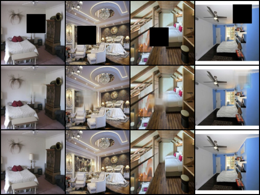

## Overview

This repository trains an image completion model using a PixelRNN-like architecture with ConvLSTM and residual/gated layers. The file `train.py` contains dataset utilities, model components, an SSIM metric implementation, and the training loop.

## Results

### Sample Outputs (Epoch 190)

**Image Layout:**
- **Top Row**: Occluded input images (with black boxes)
- **Middle Row**: Model-completed images (inpainted results)
- **Bottom Row**: Original ground truth images

The model successfully learns to fill in missing regions with visually coherent content that matches the surrounding context.

## File: `train.py`

### Class: `ImageCompletionDataset`
- Initializes with paths to occluded and original images, a transform, and a mask threshold.
- `__len__` returns the number of samples.
- `__getitem__` loads a matched occluded/original pair, applies transforms, builds a binary `mask` where the images differ by more than `mask_thresh`, and returns `(occluded, original, mask)` tensors.

### Class: `ResidualBlock`
- Two 3×3 Conv2d layers with BatchNorm and ReLU in a residual configuration.
- `forward(x)` adds the block output to the input and applies ReLU.

### Class: `GatedPixelRNNLayer`
- Gated convolutional layer: computes `f = tanh(BN(Conv(x)))` and `g = sigmoid(BN(Conv(x)))`, returns elementwise `f * g`.

### Class: `ConvLSTMCell`
- Convolutional LSTM cell operating on spatial feature maps.
- `forward(x, (h_prev, c_prev))` computes next hidden and cell states via gated convolutions.
- `init_hidden(batch_size, spatial_size, device)` creates zero-initialized `h` and `c` with given spatial dimensions.

### Function: `gaussian_window(window_size, sigma, channel)`
- Creates a separable 2D Gaussian kernel tiled across `channel` channels for local statistics in SSIM.

### Function: `ssim(img1, img2, window_size=7, sigma=1.5, data_range=1.0, eps=1e-6)`
- Computes Structural Similarity (SSIM) between two images using a Gaussian window.
- Returns a batch-mean SSIM score in [0, 1]. Higher is better.

### Class: `PixelRNN`
- Image completion network.
- Constructor builds:
  - `input_conv`: expands concatenated RGB+mask input to hidden channels.
  - `layers`: a stack of `GatedPixelRNNLayer`s.
  - `convlstm`: `ConvLSTMCell` for spatiotemporal gating across layers.
  - `res_blocks`: two residual blocks for refinement.
  - `output_conv`: maps hidden features to 3-channel RGB with sigmoid.
- `forward(img_rgb, mask)` concatenates inputs, processes through gated layers + ConvLSTM with skip connection, refines via residual blocks, and outputs completed RGB in [0, 1].

### Function: `train(occluded_dir, original_dir, save_dir, epochs, batch_size, lr, hidden_channels, device)`
- Sets up transforms (resize to 128×128, to-tensor), dataset/dataloader, model, optimizer, and logging.
- For each batch: predicts `pred`, composes `comp = occluded*(1-mask) + pred*mask`.
- Computes losses over masked regions:
  - L1 on `pred*mask` vs `original*mask`.
  - SSIM on blended prediction vs original; uses `1-SSIM` as loss.
- Optimizes weighted sum: `0.8*L1 + 0.2*(1-SSIM)`.
- Logs per-epoch metrics to `checkpoints/training_log.txt`.
- Saves checkpoints and sample grids periodically to `checkpoints/` and `checkpoints/samples/`.

### Script entry point
- When run as a script, calls `train(...)` with default hyperparameters (epochs=200, batch_size=4, lr=1e-4, hidden_channels=48) and dataset paths under `dataset/train/`.

## Datasets
- `dataset/train/occluded_images`: occluded inputs.
- `dataset/train/original_images`: corresponding originals (filenames match with `occluded_` prefix removed).

## Outputs
- `checkpoints/model_epoch{N}.pth`: saved model weights at intervals.
- `checkpoints/samples/sample_epoch{N}.png`: sample grids showing occluded, completed, and original images.
- `checkpoints/training_log.txt`: tab-separated epoch logs with LR, L1, SSIM, and total loss.

